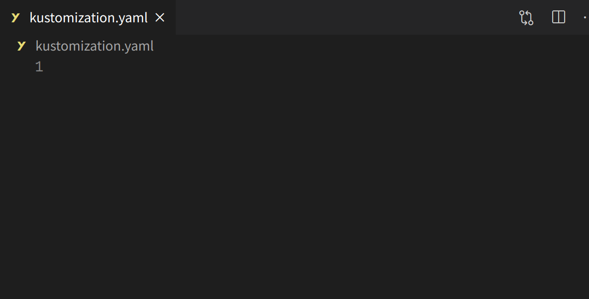
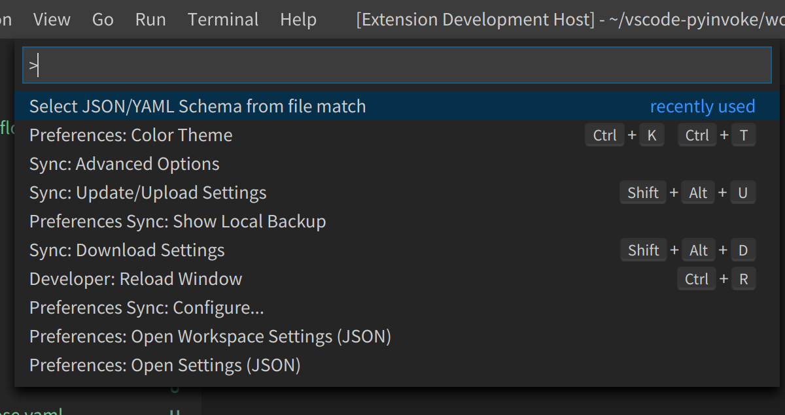
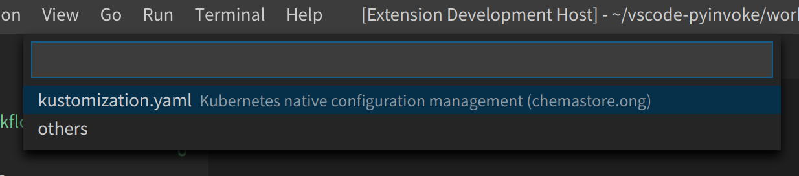
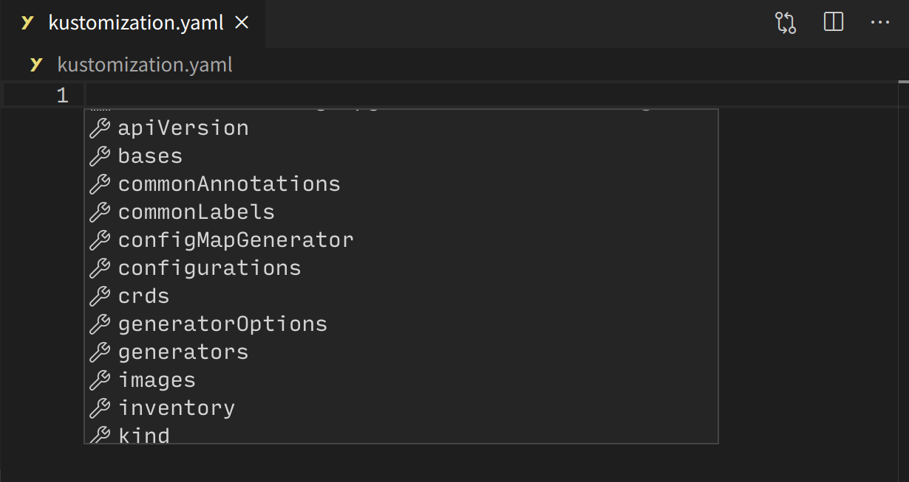
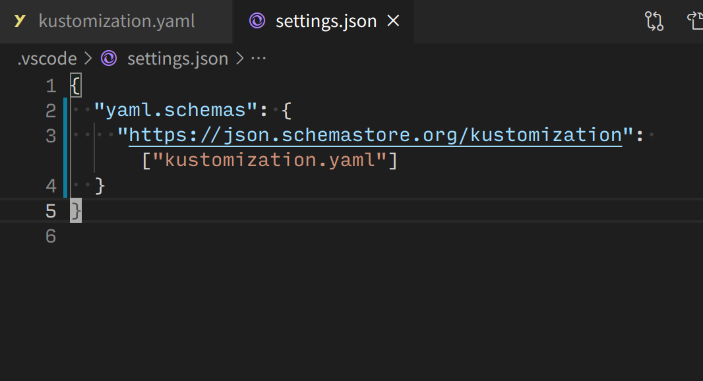

# JSON & YAML Schema elector

Setting a schemas to your JSON and YAML file quickly.

# How to use

open JSON or YAML file



run command "Select JSON/YAML Schema from file match"



select json schemas



use schema



this will set the schema to settings.json



# using schemas

This uses [JSON Schema Store](https://www.schemastore.org/json/).

## how to add schemas

Please add your settings.

```json
{
  "json-yaml-schema-selector.additionalSchemas": [
    // url
    "https://raw.githubusercontent.com/docker/compose/master/compose/config/config_schema_v3.8.json",
    // object
    {
      "name": "docker-compose",
      "description": "docker-compose 3.8",
      "url": "https://raw.githubusercontent.com/docker/compose/master/compose/config/config_schema_v3.8.json",
      "fileMatch": ["docker-compose.yaml"]
    }
  ]
}
```

# License

MIT

# thanks

Icon used from [freeicons.io](https://freeicons.io)
